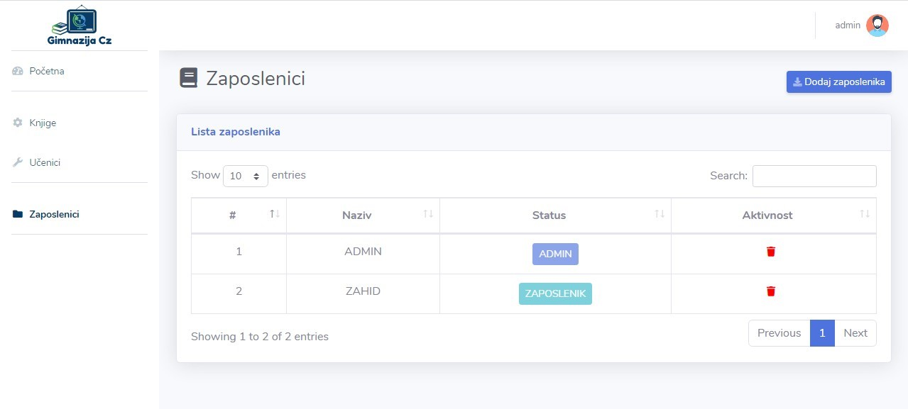

# 📚 Library Management System

A complete web application built for managing a high school library.  
The system allows managing books, students, employees, and book rentals/returns.  
Developed using **HTML**, **CSS**, **BOOTSTRAP**, **PHP**, **AJAX** and **MySQL** .

---

## Features

### Book Management
- Add new books  
- Delete books  
- Edit number of available copies  
- Display list of all books  
- Search books by title, author or category  

### Student Management
- Add students  
- Delete students  
- Display all students  
- Search students  

### 👩‍💼 Roles 
Login system for different roles  

### Borrowing & Returning Books
- Track borrowed books  
- Mark when a book is returned   

---

## Application Preview

### Homepage Preview  

### Books Display & Search  

### Add New Book  

### Employees 

### Renting and Returning Books  

### Login

---

## ⚙️ Installation & Setup
Clone the project:

git clone https://github.com/USERNAME/biblioteka_gimnazija.git

Import SQL database 

Configure DB connection

Run using XAMPP (Place the project inside the htdocs folder)

Open in browser "http://localhost/biblioteka_gimnazija"

All copyrights reserved ZahidK.

