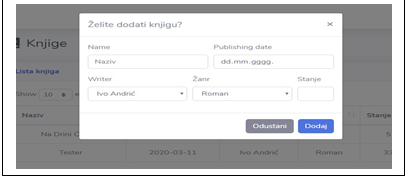

# 📚 Library Management System – "biblioteka_gimnazija"

A complete web application built for managing a high school library.  
The system allows managing books, students, employees, and book rentals/returns.  
Developed using **HTML**, **CSS**, **BOOTSTRAP**, **PHP**, **AJAX** and **MySQL** .

---

## Features

### Book Management
- Add new books  
- Delete books  
- Edit number of available copies  
- Display list of all books  
- Search books by title, author or category  

### Student Management
- Add students  
- Delete students  
- Display all students  
- Search students  

### 👩‍💼 Roles 
Login system for different roles  

### Borrowing & Returning Books
- Track borrowed books  
- Mark when a book is returned   


---

## Application Preview


### Use Case Diagram  


### Homepage Preview  


### Books Display & Search  


### Add New Book  


### Employees 


### Renting and returning books  


### Login


---

## ⚙️ Installation & Setup

1. Clone the project:
   ```bash
   git clone https://github.com/USERNAME/biblioteka_gimnazija.git

Import SQL database 
Configure DB connection
Run using XAMPP (Place the project inside the htdocs folder)
Open in browser "http://localhost/biblioteka_gimnazija"

All copyrights reserved ZahidK.


